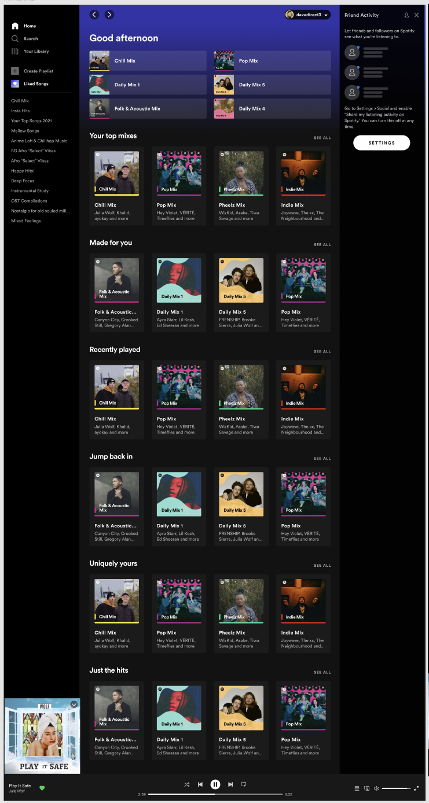

# Spotify UI Clone

Recriação da tela inicial do Spotify para desktop usando **HTML, CSS e JavaScript puro** — sem frameworks ou etapa de build.



## Como abrir

Não precisa instalar nada: basta abrir o arquivo `index.html` no navegador.

## Integração contínua

O GitHub Actions executa uma verificação de sintaxe do JavaScript a cada push para `main` e em pull requests direcionados a `main`. Também é possível iniciar a verificação manualmente pela aba **Actions** do GitHub. Esse CI valida o código, mas não publica o site.

## Estrutura

```
.
├── index.html
├── docs/
│   └── referencia.png              # layout usado como referência
└── src/assets/
    ├── css/
    │   ├── style.css               # layout base (desktop)
    │   └── responsividade.css      # ajustes por tamanho de tela
    ├── fonts/                      # Circular Std (woff2 + ttf)
    ├── icons/
    │   ├── menu/                   # Home, Search, Library, Create, Liked
    │   ├── navegacao/              # setas e chevrons
    │   ├── player/                 # controles do player
    │   └── amigos/                 # painel Friend Activity
    └── img/
        ├── covers/                 # fotos das capas e avatar
        └── logo/
```

## Destaques

- **Layout em CSS Grid**: barra lateral, conteúdo central com rolagem, painel de amigos e player fixo.
- **Capas montadas em CSS**: só a foto é imagem; nome do mix, barra colorida, onda do "Daily Mix" e logo são feitos com CSS
  (container queries + máscara SVG), então a mesma capa escala do atalho (68px) ao card (156px) sem perder nitidez.
- **Responsivo** (desktop-first):

  | Largura | Comportamento |
  |---|---|
  | > 1200px | layout completo |
  | ≤ 1200px | painel Friend Activity oculto |
  | ≤ 1024px | sidebar mais estreita, 3 cards por linha |
  | ≤ 768px | sidebar só com ícones, 2 cards por linha, player simplificado |
  | ≤ 480px | navegação inferior, mini player e cards em carrossel |

- **Acessibilidade**: navegação com `<a>`/`<button>`, `aria-label` nos botões de ícone e `alt=""` em ícones decorativos.

## Créditos

- Fotos das capas: [StockSnap](https://stocksnap.io) (licença CC0).
- Projeto de estudo, sem fins comerciais. Spotify é marca registrada da Spotify AB.
